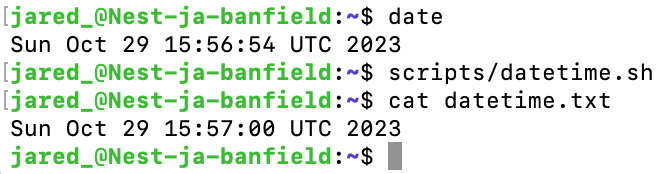
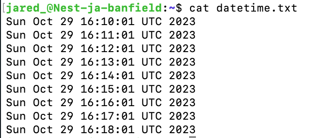
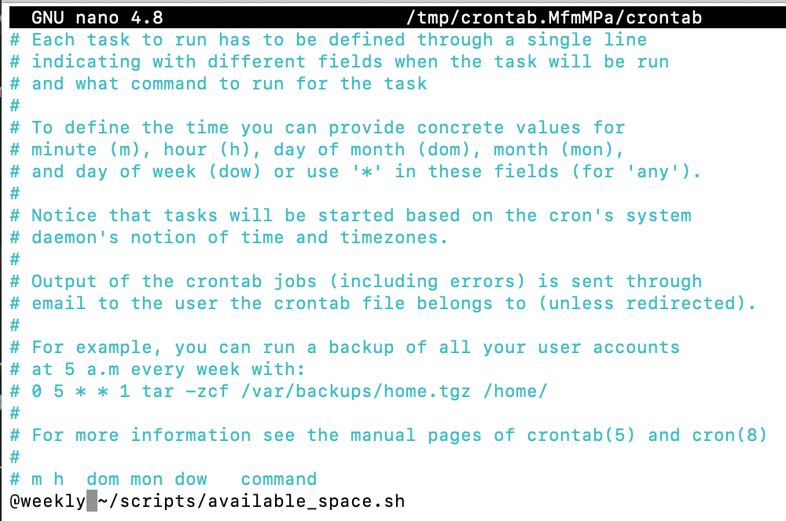

# Cron Jobs
Een cronjob is een Linux-opdracht die wordt gebruikt voor het plannen van taken die ergens in de toekomst moeten worden uitgevoerd. Dit wordt normaal gesproken gebruikt om een ​​taak te plannen die periodiek wordt uitgevoerd, bijvoorbeeld om elke ochtend een kennisgeving te verzenden.

Voor de meeste cronjobs zijn er drie componenten aanwezig:

1. Het script dat moet worden aangeroepen of uitgevoerd.
2. De opdracht die het script herhaaldelijk uitvoert.
3. De actie of uitvoer van het script, die afhangt van wat het aangeroepen script doet. Vaak wijzigen scripts die cronjobs worden genoemd bestanden of databases. Ze kunnen echter ook andere taken uitvoeren waarbij de gegevens op de server niet worden gewijzigd, zoals het verzenden van e-mailmeldingen.

## Key-terms
- **Crontab**: staat voor cron table en is een configuratiebestand dat een overzicht van cronjobs bevat. Voor het uitvoeren van die cronjobs gebruikt crontab cron. 
```
# ┌───────────── minute (0 - 59)
# │ ┌───────────── hour (0 - 23)
# │ │ ┌───────────── day of the month (1 - 31)
# │ │ │ ┌───────────── month (1 - 12)
# │ │ │ │ ┌───────────── day of the week (0 - 6) (Sunday to Saturday;
# │ │ │ │ │                                   7 is also Sunday on some systems)
# │ │ │ │ │                                   OR sun, mon, tue, wed, thu, fri, sat
# │ │ │ │ │
# * * * * * <command_here>
```

## Opdracht
### Gebruikte bronnen
- [What is Cron Job?](https://www.hivelocity.net/kb/what-is-cron-job/)
- [CronJob](https://kubernetes.io/docs/concepts/workloads/controllers/cron-jobs/)
- [What Is a Cron Job: Understanding Cron Syntax and How to Configure Cron Jobs](https://www.hostinger.com/tutorials/cron-job)
- [Cron Jobs For Beginners | Linux Task Scheduling](https://www.youtube.com/watch?v=v952m13p-b4)
- [Crontab Guru](https://crontab.guru/)
- [How to Run a Crontab Job Every Week on Sunday](https://www.geeksforgeeks.org/how-to-run-a-crontab-job-every-week-on-sunday/)
- [Classic SysAdmin: How to Check Disk Space on Linux from the Command Line](https://www.linuxfoundation.org/blog/blog/classic-sysadmin-how-to-check-disk-space-on-linux-from-the-command-line)
- [sudo echo "something" >> /etc/privilegedFile doesn't work](https://stackoverflow.com/questions/84882/sudo-echo-something-etc-privilegedfile-doesnt-work)
- [Linux Tee Command with Examples](https://linuxize.com/post/linux-tee-command/)

### Ervaren problemen
- Waarom werkt de commando `/usr/bin/sudo /usr/bin/df -H > /var/logs/available_space.txt` niet?  
Alleen de `root` mag naar de `/var`-directory schrijven. De commando's "`>`" en "`>>`" voert de shell **altijd** uit als de huidige `user`, en niet als `root` waardoor ik deze commando's niet kan gebruiken.

### Resultaat
1. Script om de huidige datum en tijd te schrijven naar een bestand in mijn home directory.  
Met `date` haal ik de datum en tijd op.
```
#!/bin/bash
/usr/bin/date >> ~/datetime.txt
```

<br><br>  
<br><br>

2. Script in crontab zodat het elke minuut ge-execute wordt. Met de commando `crontad -e` bewerk ik de crontab bestand.
```
# m h  dom mon dow   command
* * * * * /usr/bin/date >> ~/datetime.txt
```

<br><br>  
<br><br>

3. Script dat de beschikbare disk space schrijft naar een bestand in /var/logs.  

```
#!/bin/bash

/usr/bin/df -H |/usr/bin/sudo /usr/bin/tee /var/logs/available_space.txt > /dev/null
```
Met `df -H` wordt de beschikbare ruimte opgevraagd.  
Met `tee` schrijf ik de output van `df -H` naar `/var/logs/available_space.txt`.  
Met `> /dev/null` voorkom ik dat de output ook wordt geschreven naar de terminal.

<br><br>  

Het available_space.sh bestand maak ik executable met de commando:
```
chmod 774 available-space.sh
```
<br><br>  

Crontab commando om de script wekelijks te execute-en.
```
# m h  dom mon dow   command
@weekly ~/scripts/available_space.sh
```
Met `@weekly` wordt de script elke zondag om 12:00 AM ge-execute.
 
<br><br>