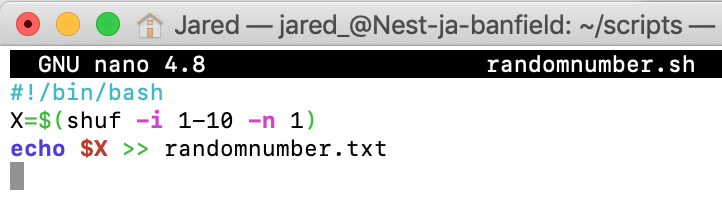
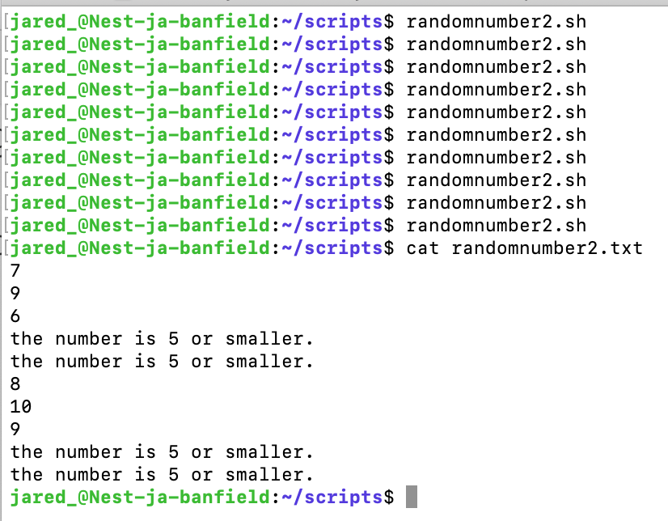

# Bash Scripts
Bash is een Unix-opdrachtregelinterface die verantwoordelijk is voor de interactie met het besturingssysteem van een computer. Net zoals filmscripts acteurs informeren over welke acties ze moeten ondernemen, vertelt een bash-script de bash-shell wat hij moet doen. Een bash-script is dus een handige manier om opdrachten te groeperen om een ​​programma te maken.

Elke opdracht die u rechtstreeks vanaf de opdrachtregel kunt uitvoeren, kan in een bash-script worden geplaatst, en u kunt verwachten dat deze dezelfde acties uitvoert als vanaf de opdrachtregel. Als alternatief kan elke opdracht die u in uw bash-script invoert, rechtstreeks vanaf de opdrachtregel worden uitgevoerd, en het resultaat zou hetzelfde moeten zijn.

## Key-terms
- **PATH variable**: is een omgevingsvariabele die een geordende lijst met paden bevat waarnaar Linux zal zoeken naar uitvoerbare bestanden bij het uitvoeren van een opdracht. Het gebruik van deze paden betekent dat we geen absoluut pad hoeven op te geven bij het uitvoeren van een opdracht.<br> 
Als we bijvoorbeeld Hallo, wereld! in Bash willen printen kan het commando `echo` worden gebruikt in plaats van `/bin/echo`, zolang /bin zich in PATH bevindt.
- **HTTPd**: Hypertext Transfer Protocol daemon. Het is een softwareprogramma dat gewoonlijk als proces op de achtergrond draait en de rol speelt van een server in een client-servermodel met behulp van de HTTP- en/of HTTPS-netwerkprotocol(len).
- **BASH**: een Unix-opdrachtregelinterface die verantwoordelijk is voor de interactie met het besturingssysteem van een computer. 

## Opdracht
### Gebruikte bronnen
- [httpd](https://en.wikipedia.org/wiki/Httpd)
- [Adding a Path to the Linux PATH Variable](https://www.baeldung.com/linux/path-variable)
- [How to Write a Bash Script: A Simple Bash Scripting Tutorial](https://www.datacamp.com/tutorial/how-to-write-bash-script-tutorial)
- [How To Install the Apache Web Server on Ubuntu 20.04](https://www.digitalocean.com/community/tutorials/how-to-install-the-apache-web-server-on-ubuntu-20-04)
- [Bash in 100 Seconds](https://www.youtube.com/watch?v=I4EWvMFj37g)
- [Generation of Random Integers in a Range in Bash](https://www.baeldung.com/linux/bash-draw-random-ints)
- [Bash if..else Statement](https://linuxize.com/post/bash-if-else-statement/)

### Ervaren problemen
- Hoe voeg ik een nieuwe directory aan de PATH variable?
- Hoe schrijf ik een script?
- Welke script heb ik nodig om een lijn van tekst toe te voegen aan een bestand wanneer de script wordt ge-execute?
- Wat zijn de commando's om de httpd package te installeren, activeren, enable-en en de status van op te vragen?
- Hoe werk ik met variabelen in ene shell script?
- Hoe genereer ik een random number in bash?
- Hoe schrijf ik if-else statements in bash?

### Resultaat
1. Met de export commando kan ik een nieuwe directory toevoegen in de PATH variable. Met deze commando voeg ik **tijdelijk** een nieuwe directory toe. Zodra ik een nieuwe shell open, ben ik deze toevoeging kwijt en moet ik het opnieuw doen.<br> 
`export PATH=$PATH:/home/jared_/scripts`

<br><br>

2. In de scripts directory heb ik een `addline.sh` bestand gemaakt. Hierin staat een commando dat een lijn toevoegd in `addline.txt`.<br> 
`echo "Wanneer addline.sh word ge-execute, wordt dit lijn aangemaakt in dit bestand" >> addline.txt`

<br><br>

3.  Bij het executen van `addline.sh` wordt een lijn toegevoegd in addline.txt.

<br><br>

4. In de script directory heb ik een `setuphttpd.sh` bestand gemaakt. Hierin heb ik de commando's gezet die nodig zijn om Apache web server te installeren, activeren, enable-en en de status ervan uit te printen in de terminal.<br> 
`sudo apt install -y apache2` -> installeert, activeert en enabled de Apache web server. De `-y` zorgt ervoor dat er autmatisch "yes" wordt beantwoord op de vragen.<br> 
`sudo systemctl status apache2` -> geeft de status van Apache web server aan in de terminal.

<br><br>

<br><br>

5. Script om een random number te genereren tussen 1 en 10. En deze in een tekstbestand te plaatsten.

```
#!/bin/bash
X=$(shuf -i 1-10 -n 1)
echo $X >> randomnumber.txt
```

<br><br>
<br><br>

6. Script om een random number te genereren tussen 1 en 10. Als het getal groter is dan 5, moet dat getal geschreven worden naar een tekstbestand. Als het getal kleiner of gelijk is aan 5, moet een stuk tekst geschreven worden naar de tekstbestand.
```
#!/bin/bash

VAR=$(shuf -i 1-10 -n 1)

if [[ $VAR -gt 5 ]]
then
  echo $VAR >> randomnumber2.txt
else
  echo "the number is 5 or smaller." >> randomnumber2.txt
fi
```

<br><br>
<br><br>
