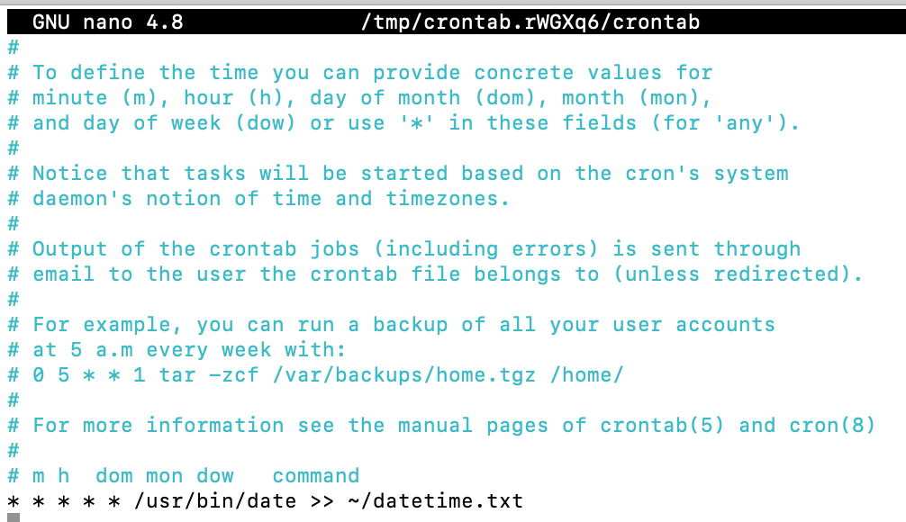
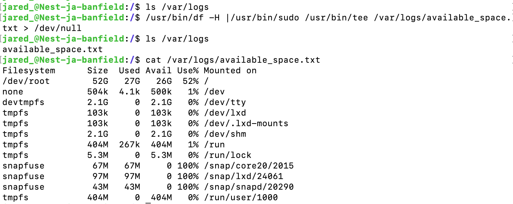
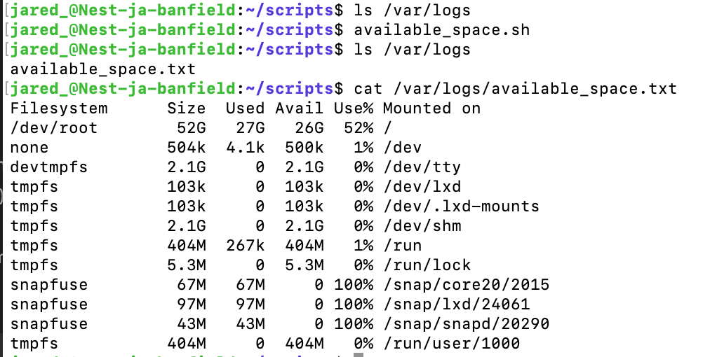

# Cron Jobs
[Geef een korte beschrijving van het onderwerp]

## Key-terms
[Schrijf hier een lijst met belangrijke termen met eventueel een korte uitleg.]

## Opdracht
### Gebruikte bronnen
- [Cron Jobs For Beginners | Linux Task Scheduling](https://www.youtube.com/watch?v=v952m13p-b4)
- [How to Run a Crontab Job Every Week on Sunday](https://www.geeksforgeeks.org/how-to-run-a-crontab-job-every-week-on-sunday/)
- [Classic SysAdmin: How to Check Disk Space on Linux from the Command Line](https://www.linuxfoundation.org/blog/blog/classic-sysadmin-how-to-check-disk-space-on-linux-from-the-command-line)
- [sudo echo "something" >> /etc/privilegedFile doesn't work](https://stackoverflow.com/questions/84882/sudo-echo-something-etc-privilegedfile-doesnt-work)
- [Linux Tee Command with Examples](https://linuxize.com/post/linux-tee-command/)

### Ervaren problemen
- Waarom werkt de commando `/usr/bin/sudo /usr/bin/df -H > /var/logs/available_space.txt` niet werkt?  
Alleen de `root` mag naar de `/var`-directory schrijven. De commando's "`>`" en "`>>`" voert de shell **altijd** uit als de huidige `user`, en niet als `root` waardoor ik deze commando's niet kan gebruiken.

### Resultaat
1. Script om de huidige datum en tijd te schrijven naar een bestand in mijn home directory.  
Met `date` haal ik de datum en tijd op.
```
#!/bin/bash
/usr/bin/date >> ~/datetime.txt
```

<br><br>  
<br><br>

2. Script in crontab zodat het elke minuut ge-execute wordt.
```
# m h  dom mon dow   command
* * * * * /usr/bin/date >> ~/datetime.txt
```

<br><br>  
<br><br>

3. Script in crontab dat wekelijks de beschikbare disk space schrijft naar een bestand in /var/logs.   
Met `@weekly` wordt de script elke zondag om 12:00 AM ge-execute.  
Met `df -H` wordt de beschikbare ruimte opgevraagd.  
Met `tee` schrijf ik de output van `df -H` naar `/var/logs/available_space.txt`.
Met `> /dev/null` voorkom ik dat de output ook wordt geschreven naar de terminal.

```
# m h  dom mon dow   command
@weekly /usr/bin/df -H |/usr/bin/sudo /usr/bin/tee /var/logs/available_space.txt > /dev/null
```

<br><br>  
<br><br>